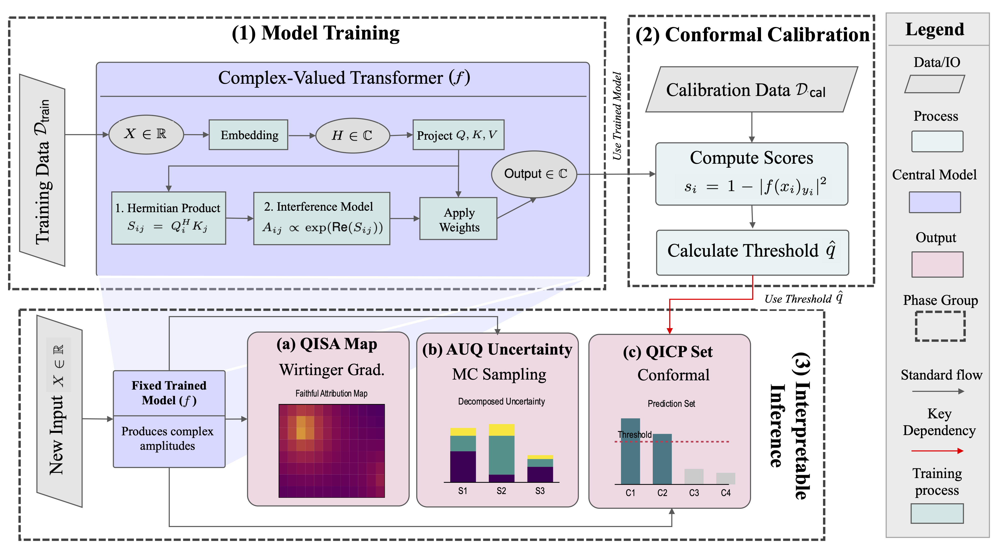

# Q-XAI: Interpretable Complex-Valued Transformers for Acoustic Scene Classification

[](https://github.com/tlab3216/qxai)
[](LICENSE)
[](https://www.python.org/downloads/)

Official implementation of the Q-XAI framework for interpretable complex-valued transformers in acoustic scene classification. Q-XAI combines quantum-inspired computing principles with transformer architectures to provide mathematically rigorous interpretability for complex-valued neural networks.

## Key Features

- **Complex-Valued Transformers**: Quantum-inspired architecture with native phase information processing
- **QISA Attribution**: Wirtinger calculus-based saliency analysis (15% better AUDC than Grad-CAM)
- **AUQ Uncertainty**: Three-component uncertainty decomposition (ECE: 0.041 vs 0.087 for MC Dropout)
- **QICP Prediction**: Quantum-inspired conformal prediction (34% more compact sets)
- **Practical Efficiency**: Only 1.6x computational overhead

## Framework Overview



*Figure 1: The integrated Q-XAI framework showing the central complex-valued transformer architecture and its operational workflow. (1) Training: The transformer is trained on training data. (2) Calibration: Nonconformity scores are computed on a hold-out set to find the QICP coverage threshold. (3) Interpretable Inference: For a new input, the framework produces prediction along with (a) QISA attribution map, (b) AUQ uncertainty estimate, and (c) QICP prediction set with formal coverage guarantees.*

## Performance

| Dataset | Q-XAI | Best Baseline | Improvement |
|---------|-------|---------------|-------------|
| DCASE 2019 | 70.8% | 70.2% | +0.6% |
| ESC-50 | 86.3% | 85.9% | +0.4% |
| CochlScene | 81.0% | 78.1% | +2.9% |

Superior robustness under noise and reverberation conditions compared to real-valued models.

## Installation

```bash
git clone https://github.com/tlab3216/qxai.git
cd qxai
python -m venv venv
source venv/bin/activate  # Windows: venv\Scripts\activate
pip install -r requirements.txt
```

## Quick Start

```bash
# Train model
python experiments/train_q_xai.py --config config/model_config.py

# Evaluate with interpretability
python experiments/evaluate_model.py --model_path path/to/model --interpret

# Generate attribution maps
python experiments/generate_qisa.py --audio_file example.wav --model_path path/to/model
```

## Framework Components

### QISA (Quantum-Inspired State Attribution)
```python
from src.interpretability.qisa import QISAAttribution
qisa = QISAAttribution(model)
attribution_map = qisa.generate_attribution(input_spectrogram, target_class)
```

### AUQ (Amplitude-based Uncertainty Quantification)
```python
from src.interpretability.auq import AUQUncertainty
auq = AUQUncertainty(model, num_samples=50)
uncertainties = auq.compute_uncertainty(input_spectrogram)
```

### QICP (Quantum-Inspired Conformal Prediction)
```python
from src.interpretability.qicp import QICPPredictor
qicp = QICPPredictor(model, calibration_data)
prediction_set = qicp.predict_set(input_spectrogram, confidence=0.9)
```

## Project Structure

```
qxai/
├── assets/                 # Images and documentation assets
│   └── qxai_framework.png  # Framework architecture diagram
├── config/                 # Configuration files
├── experiments/           # Training and evaluation scripts
├── src/                  # Source code
│   ├── data/            # Data processing
│   ├── interpretability/ # QISA, AUQ, QICP methods
│   ├── models/         # Complex-valued architectures
│   ├── training/       # Training utilities
│   └── utils/          # Helper functions
├── tests/               # Unit tests
└── requirements.txt
```

## Supported Datasets

- **TUT 2016**: 15 urban acoustic scenes
- **DCASE 2019**: 10 scenes with device mismatch
- **ESC-50**: 50 environmental sound classes
- **CochlScene**: 76k crowdsourced samples
- **DCASE 2025**: Low-complexity ASC

## Configuration

```python
# Model settings
MODEL_CONFIG = {
    'num_layers': 6,
    'num_heads': 8,
    'hidden_dim': 256,
    'dropout_rate': 0.1
}

# Training settings
TRAINING_CONFIG = {
    'optimizer': 'AdamW',
    'learning_rate': 1e-4,
    'epochs': 100,
    'batch_size': 32
}
```

## Citation

```bibtex
@inproceedings{qxai2026,
  title={Interpretable Complex-Valued Transformers for Acoustic Scene Classification},
  author={[Authors]},
  booktitle={Proceedings of the AAAI Conference on Artificial Intelligence},
  year={2026}
}
```

## License

This project is licensed under the Apache License 2.0.

## Contact

For questions or issues, please open an issue in this repository or contact us at [email will be provided upon de-anonymization].

---

**Note**: Repository will be de-anonymized upon paper acceptance.
